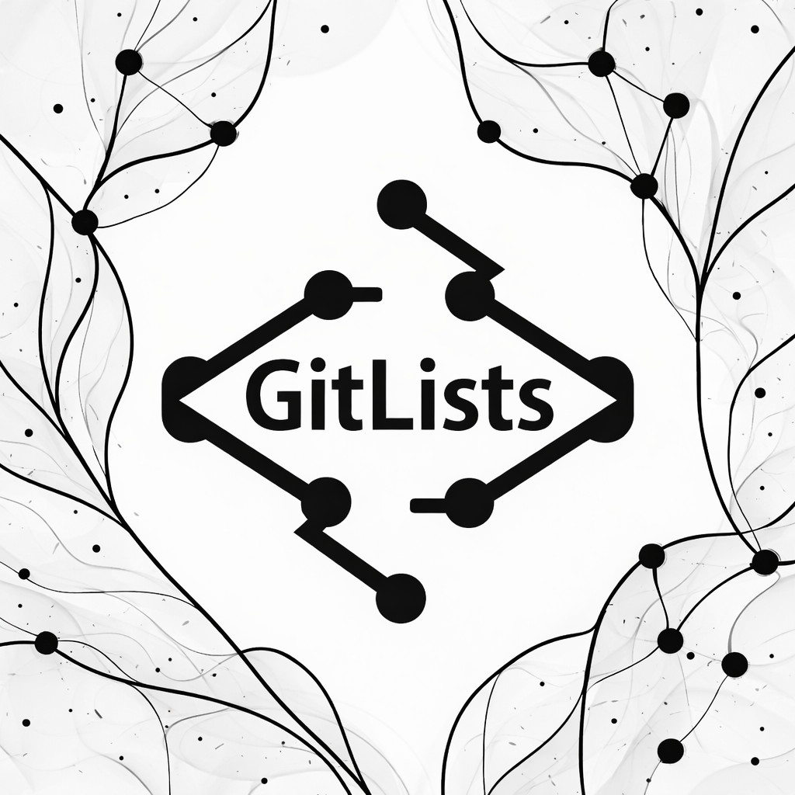
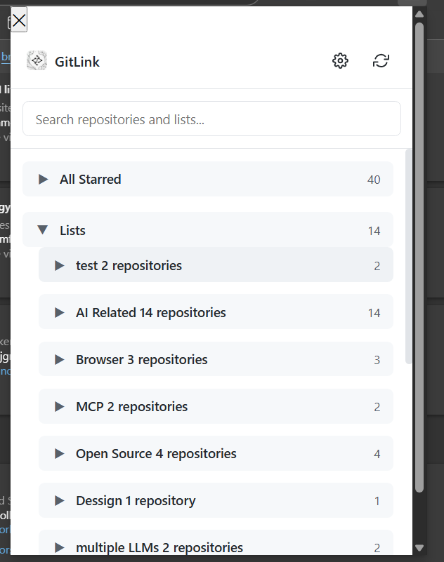
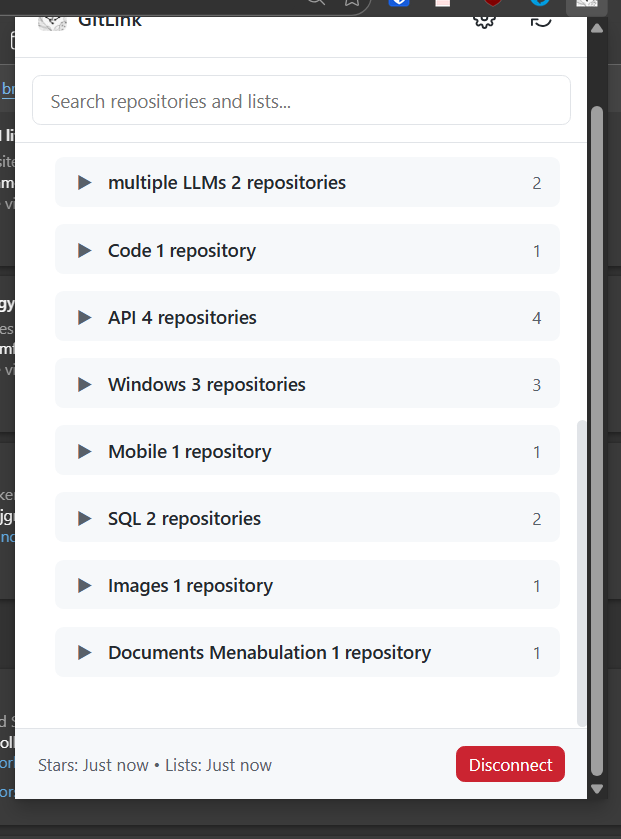
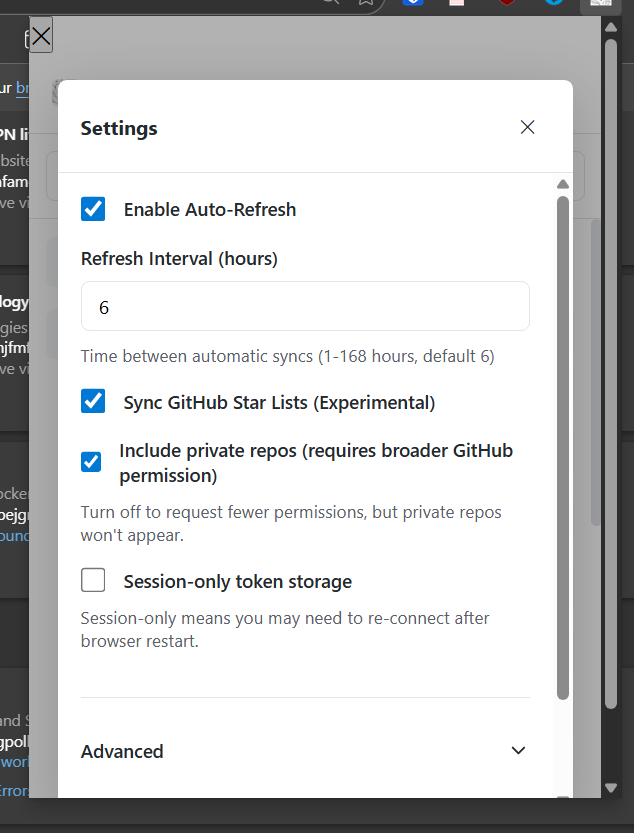

# GitLists - Microsoft Edge Extension



<p align="center">
  <a href="https://microsoftedge.microsoft.com/addons/detail/oljdllmbnhclaijkeahbdkccachkifpa" target="_blank">
    
  </a>
</p>

GitLists is a Microsoft Edge extension that helps you browse and manage your GitHub starred repositories and star lists with intelligent bookmarking capabilities.

<p align="center">
  
  
  
</p>

## Features

- 🌟 **Browse Starred Repositories**: View all your GitHub starred repos in a clean, organized interface
- 📋 **Star Lists Management**: Access and manage your GitHub star lists (experimental)
- 🔄 **Auto-Sync**: Automatically sync your stars and lists at configurable intervals
- 🔍 **Smart Search**: Quickly find repositories and lists with intelligent search
- 🔐 **Secure Authentication**: Uses GitHub's OAuth Device Flow for secure authentication
- ⚡ **Fast Performance**: Optimized for Microsoft Edge with efficient caching

## Installation

### From Microsoft Edge Add-ons Store (Recommended)

**✅ Now Available!** Install directly from the Microsoft Edge Add-ons store:

<p align="center">
  <a href="https://microsoftedge.microsoft.com/addons/detail/oljdllmbnhclaijkeahbdkccachkifpa" target="_blank">
    
  </a>
</p>

1. Click the download button above or visit the [Edge Add-ons store](https://microsoftedge.microsoft.com/addons/detail/oljdllmbnhclaijkeahbdkccachkifpa)
2. Click "Get" to install
3. The extension will be added to your Edge browser automatically
4. Click the GitLists icon in your toolbar to get started

### Browser Availability

**Microsoft Edge** is the primary supported browser for this extension:
- **Edge Add-ons Store**: ✅ Available now!
- **Manual Install**: Also available via GitHub Releases

**Google Chrome** version is also available:
- **Chrome Web Store**: Not available (requires paid developer account)
- **Manual Install**: Pre-built Chrome packages (marked "for Chrome") are provided with each GitHub Release
- **Source Code**: Will be shared publicly when the extension is published to official stores

**Note**: Both Edge and Chrome builds are provided as ready-to-install packages in [GitHub Releases](https://github.com/sammerasker/GitList/releases). Download the appropriate version for your browser.

### Manual Installation (For End Users)

**Step-by-step installation from GitHub Releases:**

1. **Download the Extension**
   - Visit [GitHub Releases](https://github.com/sammerasker/GitList/releases)
   - Download the latest `gitlink-edge-extension.zip` file
   - Extract the ZIP file to a permanent location on your computer

2. **Enable Developer Mode in Edge**
   - Open Microsoft Edge
   - Navigate to `edge://extensions/`
   - Toggle "Developer mode" ON (switch in the left sidebar)
   - This allows loading extensions from local files

3. **Load the Extension**
   - Click "Load unpacked" button
   - Navigate to the extracted folder
   - Select the folder that contains `manifest.json` (typically the `dist` folder inside the extracted files)
   - Click "Select Folder"

4. **Verify Installation**
   - The GitLink extension should now appear in your extensions list
   - Ensure it's enabled (toggle switch is ON)

5. **Pin the Extension**
   - Click the Extensions button (puzzle piece icon) in the Edge toolbar
   - Find "GitLink" in the list
   - Click the pin icon to keep it visible in your toolbar

### Manual Installation (For Maintainers/Developers)

1. **Clone and Setup Environment**
   ```bash
   git clone https://github.com/sammerasker/GitList.git
   cd GitList/Edge
   npm install
   ```

2. **Configure Build Environment (Maintainers Only)**
   ```bash
   # Copy the environment template
   cp .env.example .env
   
   # Edit .env and set your GitHub OAuth Client ID
   # Get a Client ID from: https://github.com/settings/developers
   ```
   
   Your `.env` file should look like:
   ```
   GITLINK_OAUTH_CLIENT_ID=your_github_oauth_client_id_here
   ```
   
   **Note**: End users do NOT need to create a `.env` file. The OAuth Client ID is injected at build time by maintainers.

3. **Build the Extension**
   ```bash
   npm run build
   ```

4. **Load in Microsoft Edge**
   - Open Microsoft Edge
   - Navigate to `edge://extensions/`
   - Enable "Developer mode" (toggle in the left sidebar)
   - Click "Load unpacked"
   - Select the `dist` folder

5. **Pin the Extension**
   - Click the Extensions button (puzzle piece icon) in the toolbar
   - Find "GitLink" and click the pin icon to keep it visible

## Usage

1. **Connect Your GitHub Account**
   - Click the GitLink icon in your Edge toolbar
   - Click "Connect GitHub"
   - Follow the OAuth flow to authorize the extension

2. **Browse Your Stars**
   - Your starred repositories will appear in the extension popup
   - Use the search bar to quickly find specific repos
   - Click on any repository to open it in a new tab

3. **Configure Settings**
   - Click the gear icon to access settings
   - Enable auto-refresh and set sync intervals
   - Enable experimental star lists sync

## Microsoft Edge Compatibility

This extension is specifically optimized for Microsoft Edge and requires:
- Microsoft Edge (Chromium) with Manifest V3 support (latest stable version recommended)
- Modern JavaScript features (ES2020+)

**Note**: While the extension was developed for Edge 88+, we recommend using the latest stable version of Microsoft Edge for the best experience and security updates.

## In-Extension Developer Mode (Advanced)

GitLink includes a hidden **Developer Mode** for advanced users and developers. This is separate from Edge's extension loading "Developer mode" toggle.

### What It Enables

When enabled, Developer Mode reveals:
- **Diagnostics Section**: Test buttons for manual sync operations
- **Test Refresh Button**: Manually trigger a sync and view console logs
- **Test Lists Scraping**: Test the lists scraping functionality on GitHub pages
- **OAuth Client ID Override**: Override the built-in GitHub OAuth Client ID for testing custom OAuth apps

### How to Enable

1. Open the GitLink extension popup
2. Click the Settings (gear) icon
3. Expand the "Advanced" section
4. Click the version label text (e.g., "GitLink v1.0.0") **7 times** within 5 seconds
5. A notification will confirm "Developer Mode enabled!"
6. The Diagnostics section will now be visible

### How to Disable

1. Open Settings → Advanced
2. Scroll to the Diagnostics section (now visible)
3. Click "Disable Developer Mode" button
4. The diagnostics section will be hidden again

**Note**: Developer Mode state is stored locally in your browser. If you uninstall and reinstall the extension, you'll need to re-enable it.

## Development

### Building the Extension

```bash
# Install dependencies
npm install

# Build for production (maintainers only - requires .env)
npm run build

# Build with Edge-specific optimizations
npm run build:edge

# Development build with watch mode
npm run watch

# Create distribution package
npm run package
```

**Note for Maintainers**: Only allowlisted documentation files (README.md, LICENSE, PRIVACY.md, SECURITY.md, CONTRIBUTING.md) are committed to git. Other markdown files are ignored to keep the repository clean.

### Project Structure

```
src/
├── background/     # Service worker and background scripts
├── content/        # Content scripts for GitHub pages
├── popup/          # Extension popup UI
└── shared/         # Shared utilities and types
static/
├── images/         # Extension icons
└── manifest.json   # Edge extension manifest
```

## Privacy & Security

- **No Data Collection**: GitLink doesn't collect or store any personal data
- **Local Storage Only**: All data is stored locally in your browser
- **Secure Authentication**: Uses GitHub's official OAuth Device Flow
- **Minimal Permissions**: Only requests necessary permissions for GitHub API access

For detailed information:
- [Privacy Policy](../PRIVACY.md) - How we handle your data
- [Security Policy](../SECURITY.md) - Security practices and reporting vulnerabilities

## Contributing

We welcome contributions! Please see our [Contributing Guide](../CONTRIBUTING.md) for details on:
- Development setup
- Code standards
- Pull request process
- Community guidelines

1. Fork the repository
2. Create a feature branch (`git checkout -b feature/amazing-feature`)
3. Make your changes
4. Test thoroughly in Microsoft Edge
5. Commit your changes (`git commit -m 'Add amazing feature'`)
6. Push to the branch (`git push origin feature/amazing-feature`)
7. Open a Pull Request

## License

MIT License - see [LICENSE](LICENSE) file for details.

## Related Projects

- **[GitLink for Chrome](https://github.com/sammerasker/GitList)** - Chrome version available via GitHub Releases only (not on Chrome Web Store)

## Troubleshooting

### Lists Sync Issues

**Problem**: Lists sync fails or shows 0 lists

**Solutions**:
- Ensure you're logged into GitHub in the same Edge browser profile
- Visit your GitHub stars page manually first: `https://github.com/YOUR_USERNAME?tab=stars`
- Check that you have created star lists on GitHub
- Try disconnecting and reconnecting your GitHub account in the extension

### Extension Popup is Blank

**Problem**: Extension popup shows a blank screen after update

**Solutions**:
- Disable and re-enable the extension: `edge://extensions/` → Toggle OFF then ON
- If that doesn't work, remove and reinstall the extension
- Clear browser cache and restart Edge

### Viewing Service Worker Logs

For debugging or reporting issues:
1. Navigate to `edge://extensions/`
2. Find GitLink in the extensions list
3. Click "Details"
4. Scroll to "Inspect views"
5. Click "service worker" link to open DevTools
6. View console logs for detailed error messages

### Authentication Issues

**Problem**: "Could not connect to GitHub" or authentication fails

**Solutions**:
- Ensure you're connected to the internet
- Check if GitHub is accessible in your browser
- Try the OAuth flow again (disconnect and reconnect)
- Clear extension storage: Settings → Disconnect → Reconnect

### Performance Issues

**Problem**: Extension is slow or unresponsive

**Solutions**:
- Reduce auto-refresh frequency in Settings
- Disable lists sync if you have many lists (Settings → Lists Sync toggle)
- Check Edge's Task Manager (`Shift+Esc`) for memory usage
- Restart Edge browser

**Still having issues?** Check the [GitHub Issues](https://github.com/sammerasker/GitList/issues) page or open a new issue with:
- Edge version (`edge://version/`)
- Extension version (visible in `edge://extensions/`)
- Console logs from service worker (see "Viewing Service Worker Logs" above)

## Support

If you encounter any issues:

1. Check the [Troubleshooting](#troubleshooting) section above
2. Review the [Issues](https://github.com/sammerasker/GitList/issues) page
3. Ensure you're using a supported Edge version (latest stable recommended)
4. Try disconnecting and reconnecting your GitHub account
5. Check the service worker console for error messages (see Troubleshooting section)

---

**Star this repository if you find it useful!** ⭐